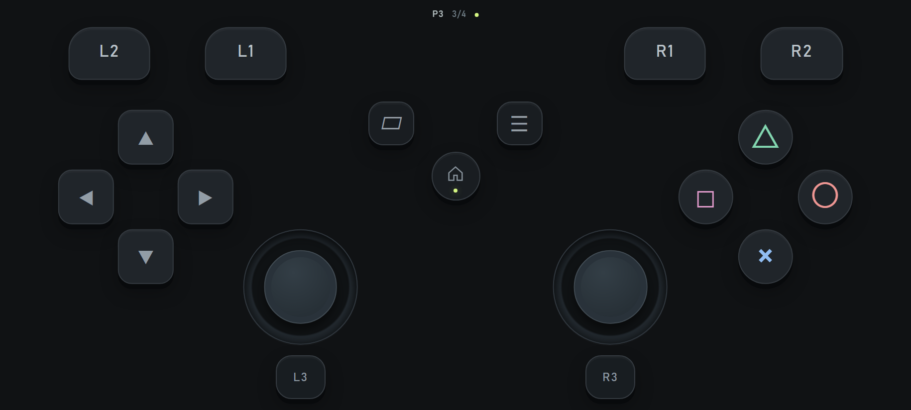
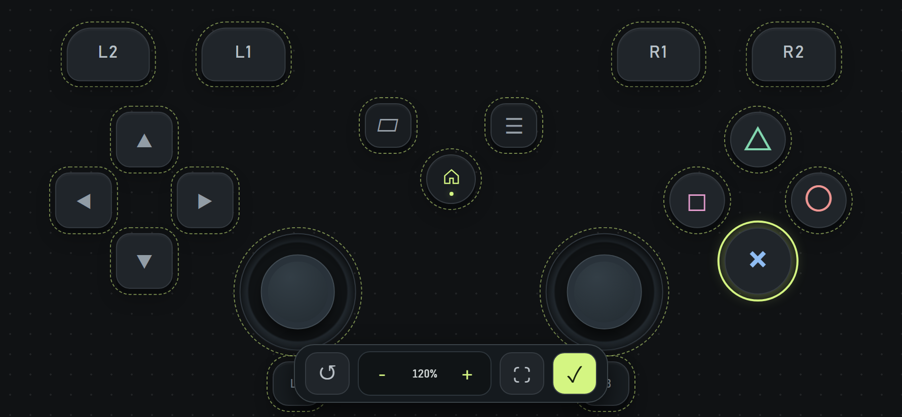
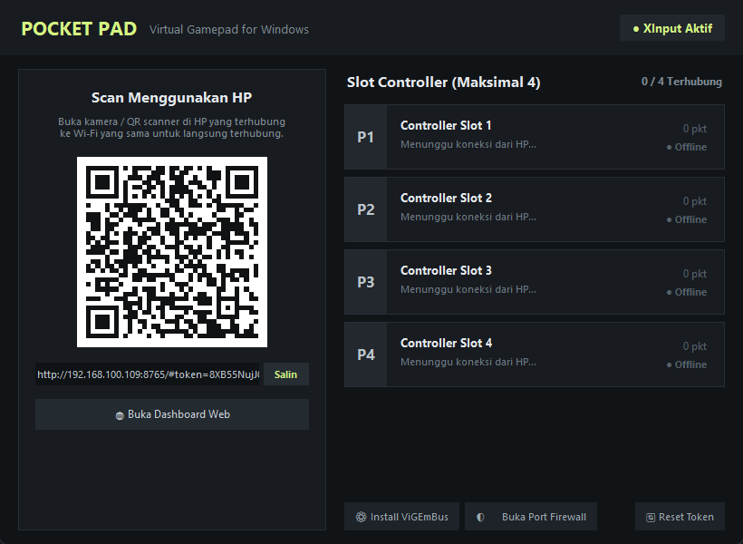
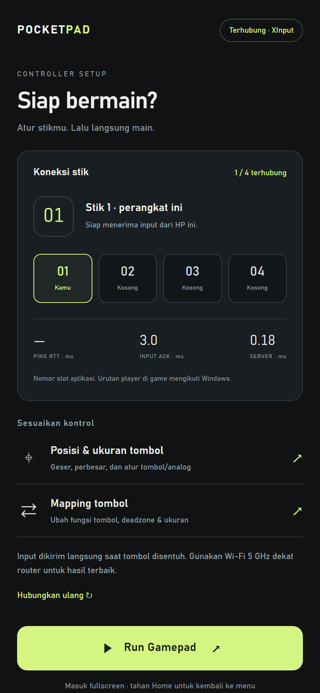
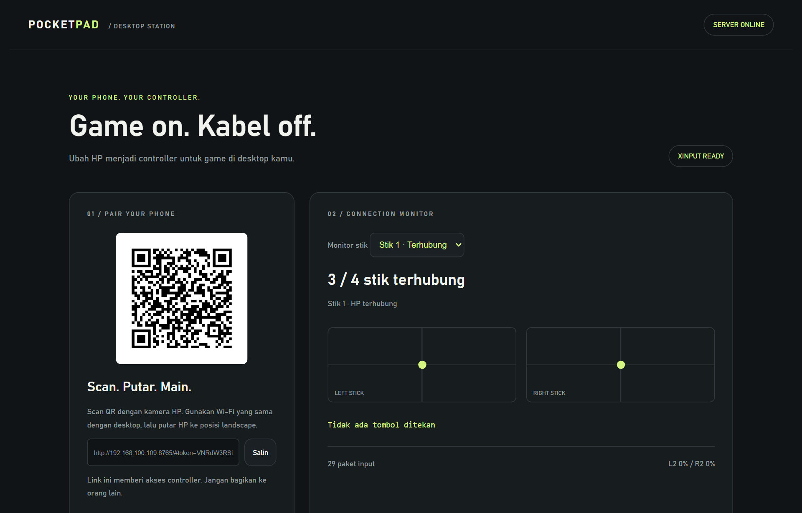

# Pocket Pad 🎮

**Pocket Pad** adalah aplikasi gamepad virtual untuk smartphone yang terhubung langsung ke PC Windows via Wi-Fi lokal, mengemulasikan controller fisik **Xbox 360 / XInput** secara real-time dengan latensi ultra-rendah (sub-milidetik).

Cukup jalankan aplikasi desktop **`Gamepad.exe`** di Windows, scan QR code yang muncul langsung di jendela aplikasi menggunakan kamera HP, dan smartphone Anda seketika berubah menjadi gamepad nirkabel layar penuh tanpa perlu install aplikasi tambahan di ponsel.

---

## 📸 Tangkapan Layar (Screenshots)

### 1. Gamepad HP Layar Penuh (Fullscreen Murni)
Layar bermain bersih tanpa teks atau tombol antarmuka yang mengganggu. Mendukung multi-touch, dual analog stick, tombol aksi, dan L1/R1/L2/R2.



### 2. Mode Editor Tata Letak & Perbesar Tombol
Atur posisi setiap tombol dengan menggesernya secara bebas. Ketuk tombol untuk memperbesar (`+`) atau memperkecil (`-`) ukurannya (skala 60% s/d 220%), atau gunakan gesture cubitan 2 jari (*pinch to zoom*).



### 3. Aplikasi Windows Desktop & Menu HP
Aplikasi Windows mandiri (`Gamepad.exe`) menampilkan QR code pairing langsung di layar PC beserta status 4 slot pemain. Di HP, tersedia menu lengkap untuk memilih slot pemain (P1–P4) dan opsi mapping.

| Aplikasi Windows Native (`Gamepad.exe`) | Tampilan Menu Setup di HP |
| :---: | :---: |
|  |  |

### 4. Dashboard Web Host
Alternatif monitoring via web browser di `http://127.0.0.1:8765/host` untuk melihat QR code dan diagnostik koneksi LAN.



---

## ✨ Fitur Utama

- **Aplikasi Windows Native 1x Klik (`Gamepad.exe`)**:
  - Aplikasi desktop mandiri (standalone executable). Cukup klik dua kali untuk menjalankan.
  - **Tampilan QR Code di Windows**: QR code pairing langsung tampil di dalam jendela aplikasi desktop.
  - **Monitor 4 Slot Controller**: Memantau status koneksi, jumlah paket, dan mode stik 1–4 secara real-time.
  - Tombol cepat untuk pasang driver ViGEmBus, buka firewall, atau reset token pairing.
- **Installer & Shortcut Generator**:
  - Tersedia **`Installer.exe`** (Wizard GUI) dan **`installer.bat`** (1-klik batch setup).
  - Otomatis membuat **Shortcut Desktop** & **Start Menu** dengan ikon gamepad kustom.
  - Otomatis memeriksa & menginstal driver resmi ViGEmBus serta mengatur izin Windows Firewall.
  - Tersedia **`uninstall.bat`** untuk menghapus shortcut & rule firewall dengan bersih kapan saja.
- **Tampilan Gamepad HP Fullscreen Murni**:
  - Saat bermain (*Run Gamepad*), layar HP 100% bersih hanya berisi tombol gamepad tanpa header, footer, teks status, atau tombol antarmuka yang mengganggu.
  - Tampilan controller bergaya PlayStation / Xbox (D-Pad, × ○ □ △, L1/R1, L2/R2, L3/R3, Dual Analog Stick, Share, Options, Home).
- **Menu Setup Interaktif di HP**:
  - **Slot Controller 1–4 (Multiplayer)**: Mendukung hingga 4 HP terhubung bersamaan ke 1 PC sebagai Pemain 1, 2, 3, dan 4.
  - **Indikator Koneksi & Slot**: Menampilkan slot stik aktif Anda (`Stik 01`) dan jumlah HP yang terhubung (`1 / 4 terhubung`).
  - **Status Latensi Real-Time**: Menampilkan PING RTT dan round-trip ACK input secara live.
- **Kustomisasi Posisi & Ukuran Tombol (Drag & Scale)**:
  - **Perbesar / Perkecil Per Tombol**: Ketuk tombol mana saja di mode edit, lalu atur ukurannya dengan tombol `＋` / `－` (skala 60% s/d 220%).
  - **Gesture 2 Jari (Pinch-to-Zoom)**: Cubit atau lebarkan dua jari langsung pada tombol/layar untuk memperbesar atau memperkecil secara fleksibel.
  - **Geser Bebas (Drag & Drop)**: Pindahkan posisi setiap tombol dan analog sesuai jangkauan jempol Anda.
  - **Slider Ukuran Global**: Tersedia slider untuk mengubah ukuran seluruh tombol atau seluruh analog stik sekaligus di menu pengaturan.
  - **Penyimpanan Otomatis**: Posisi dan ukuran tersimpan permanen di `localStorage` HP (tata letak *landscape* dan *portrait* tersimpan terpisah).
- **Remapping & Pengaturan Analog**:
  - Remap fungsi setiap tombol ke tombol controller mana pun.
  - Pengaturan *radial deadzone* analog agar bidikan/gerakan tidak *drifting*.
  - Opsi *Swap Sticks* untuk menukar analog kiri dan kanan (cocok untuk kidal).
- **Protokol Biner 16-Byte Ultra-Low Latency**:
  - Mengirim stream data biner mentah (*ArrayBuffer*) 16 byte per paket melalui WebSocket lokal.
  - Dilengkapi `TCP_NODELAY` dan kompresi nonaktif (*zero serialization delay* & *zero GC pause*).
  - Benchmark latensi input ke driver Windows rata-rata **0,06 ms** dengan RTT transmisi lokal **0,27 ms**.
- **Watchdog & Auto-Neutral**:
  - Input otomatis dinetralkan jika koneksi terputus, HP diminimalkan, atau layar mati, mencegah tombol tersangkut (*stuck key*) di dalam game.

---

## 📁 Struktur File Lengkap Proyek

```text
controler/
├── Gamepad.exe                  # Aplikasi Desktop Windows (GUI + Server + QR Terpadu)
├── Installer.exe                # Wizard GUI Installer & Pembuat Shortcut Windows
├── installer.bat                # Script batch otomatis instalasi & shortcut
├── create_shortcut.ps1          # Script PowerShell pembuat shortcut Desktop & Start Menu
├── uninstall.bat                # Script pembersih shortcut & firewall rule
├── app_gui.py                   # Source code aplikasi GUI Windows Gamepad
├── installer_gui.py             # Source code GUI installer Windows
├── icon.ico                     # Ikon aplikasi resolusi tinggi (multi-size)
├── .gitignore                   # Konfigurasi file yang diabaikan Git
├── .gitattributes               # Penanganan line endings Windows & Linux
├── LICENSE                      # Lisensi open-source MIT
├── README.md                    # Dokumentasi lengkap proyek
├── requirements.txt             # Dependensi runtime Python (aiohttp, qrcode, pillow, vgamepad)
├── requirements-dev.txt         # Dependensi testing (pytest, pytest-asyncio, playwright)
├── setup.bat                    # Script setup virtual environment Python
├── start.bat                    # Script peluncur via command-line / python
├── launch.py                    # Launcher background server & web host
├── server.py                    # Server HTTP & WebSocket biner (manajemen 4 slot XInput)
├── protocol.py                  # Definisi protokol tombol, validasi state, & normalisasi axis
├── enable-firewall.ps1          # Script PowerShell pembuka firewall port TCP 8765 LAN
├── installers/
│   └── ViGEmBus_1.22.0_...exe  # Installer resmi driver ViGEmBus Windows XInput
├── static/
│   ├── index.html               # Halaman web controller HP (Menu, Editor, Gamepad)
│   ├── app.js                   # Logika antarmuka HP, pointer events, drag & drop, touch scale
│   ├── input.js                 # Encoder paket biner 16-byte, remap buttons, analog processing
│   ├── controller.css           # Styling visual gamepad fullscreen & scaling CSS
│   ├── menu.css                 # Styling menu landing page HP & dialog settings
│   ├── host.html                # Dashboard desktop host untuk monitor 4 slot & QR code
│   ├── host.js                  # Logika dashboard host & polling status
│   └── style.css                # Styling dasar dashboard host
└── tests/
    ├── test_protocol.py         # Unit test validasi input & tombol
    ├── test_server.py           # Unit test server endpoint API & WebSocket handshake
    ├── test_backend_slots.py    # Unit test alokasi slot stik 1–4 & isolasi multi-client
    ├── test_launch.py           # Unit test launcher subprocess
    ├── test_surface.py          # Unit test aset statis web
    ├── input.test.cjs           # Unit test wire format biner 16-byte (Node.js)
    ├── verify_scaling.py        # Acceptance test Playwright: perbesar/perkecil tombol & persistensi
    ├── verify_menu.py           # Acceptance test Playwright: navigasi menu & pemilihan slot
    ├── verify_layout.py         # Acceptance test Playwright: editor posisi & boundaries
    ├── verify_live.py           # E2E test Playwright: integrasi browser touch ke driver XInput
    └── verify_latency.py        # Benchmark pengujian latensi pemrosesan input
```

---

## ⚙️ Persyaratan Sistem

1. **PC / Laptop (Host Server)**:
   - Sistem Operasi: **Windows 10 / 11 (64-bit)**.
   - Driver Gamepad: **ViGEmBus 1.22.0** (installer resmi sudah disertakan di folder `installers/`).
   - *(Opsional untuk pengembang)*: Python 3.10+ jika ingin memodifikasi source code.
2. **Smartphone (Client Controller)**:
   - Perangkat: Android atau iOS (iPhone / iPad).
   - Browser: Chrome, Safari, Firefox, Edge, atau browser modern lainnya.
   - Jaringan: Terhubung ke **Wi-Fi yang sama** dengan PC (disarankan 5 GHz).

---

## 🚀 Panduan Instalasi & Menjalankan

### Cara 1: Menggunakan Installer (Rekomendasi)
1. Klik dua kali **`Installer.exe`** (atau jalankan **`installer.bat`**).
2. Ikuti petunjuk di layar:
   - Driver ViGEmBus akan otomatis dicek dan dijalankan jika belum ada.
   - Port Firewall TCP 8765 otomatis diizinkan untuk Wi-Fi lokal.
   - Shortcut **Pocket Pad** otomatis dibuat di **Desktop** dan **Start Menu**.
3. Selesai! Anda cukup membuka shortcut **Pocket Pad** di Desktop kapan pun ingin bermain.

### Cara 2: Langsung Jalankan Aplikasi (`Gamepad.exe`)
1. Pastikan driver ViGEmBus sudah terpasang (jika belum, jalankan `installers\ViGEmBus_1.22.0_x64_x86_arm64.exe`).
2. Jalankan `enable-firewall.ps1` sebagai Administrator (hanya perlu sekali).
3. Klik dua kali **`Gamepad.exe`**.
4. Jendela aplikasi Pocket Pad akan langsung terbuka dengan QR code pairing siap scan.

---

## 📱 Cara Menggunakan di HP

1. Buka kamera atau aplikasi pemindai QR di HP Anda, lalu arahkan ke QR Code yang tampil di jendela **Pocket Pad** pada monitor PC.
2. Buka link yang muncul. Anda akan melihat **Menu Utama Pocket Pad**:
   - Di bagian atas terlihat slot stik Anda (misal `01`) dan status koneksi (*Terhubung · XInput*).
   - Jika bermain multiplayer bersama teman, pilih slot stik kosong (`01`, `02`, `03`, atau `04`).
3. **Mengatur Ukuran & Posisi Tombol**:
   - Tekan menu **Posisi & ukuran tombol**.
   - Ketuk tombol mana saja yang ingin diubah ukurannya (ditandai bingkai hijau neon).
   - Tekan **`＋`** untuk memperbesar, atau **`－`** untuk memperkecil (atau gunakan cubitan 2 jari langsung di layar).
   - Geser tombol ke posisi yang pas dengan jempol tangan Anda.
   - Tekan tombol centang **`✓`** untuk menyimpan.
4. **Mulai Bermain**:
   - Tekan tombol hijau **Run Gamepad**.
   - Putar HP ke posisi mendatar (*landscape*).
   - Layar seketika berubah menjadi gamepad murni layar penuh tanpa teks apa pun.
   - Buka game favorit Anda di PC (Steam, Emulator, Game Pass, Epic Games, dll). Game akan langsung mendeteksi stik Anda sebagai controller Xbox 360 resmi!
5. **Kembali ke Menu / Edit Saat Main**:
   - Tahan tombol **Home (ikon rumah)** selama 0,75 detik untuk kembali ke menu pengaturan kapan saja.

---

## 🔬 Spesifikasi Protokol Wire Format (16-Byte Binary)

| Offset (Byte) | Tipe Data | Deskripsi |
|---|---|---|
| `0..1` | `uint16` (LE) | Magic Header `0x5044` (`'PD'`) |
| `2` | `uint8` | Flags status paket |
| `3` | `uint8` | Reserved (padding) |
| `4..5` | `uint16` (LE) | Bitmask status 15 tombol digital |
| `6..7` | `int16` (LE) | Left Stick X axis (-32768 s/d 32767) |
| `8..9` | `int16` (LE) | Left Stick Y axis (-32768 s/d 32767) |
| `10..11` | `int16` (LE) | Right Stick X axis (-32768 s/d 32767) |
| `12..13` | `int16` (LE) | Right Stick Y axis (-32768 s/d 32767) |
| `14` | `uint8` | Left Trigger / L2 (0 s/d 255) |
| `15` | `uint8` | Right Trigger / R2 (0 s/d 255) |

---

## 🧪 Pengujian Otomatis (Testing Suite)

```bat
:: Jalankan unit test Python
.venv\Scripts\python.exe -m pytest -q

:: Jalankan unit test protokol biner (Node.js)
node --test tests\input.test.cjs

:: Uji fitur perbesar/perkecil tombol di browser
.venv\Scripts\python.exe tests\verify_scaling.py

:: Uji alur menu & multi-slot controller
.venv\Scripts\python.exe tests\verify_menu.py

:: Uji drag & drop posisi tombol serta persistensi
.venv\Scripts\python.exe tests\verify_layout.py

:: Uji live touch browser langsung ke register Windows XInput
.venv\Scripts\python.exe tests\verify_live.py

:: Uji benchmark latensi transmisi
.venv\Scripts\python.exe tests\verify_latency.py
```

---

## ❓ Pemecahan Masalah (Troubleshooting)

- **HP tidak bisa membuka halaman saat scan QR code (ERR_CONNECTION_TIMED_OUT)**:
  - Pastikan HP dan PC terhubung ke Wi-Fi yang sama.
  - Jalankan tombol **Buka Port Firewall** di aplikasi desktop atau jalankan `enable-firewall.ps1` sebagai Administrator.
  - Periksa apakah router Anda mengaktifkan fitur *AP Isolation / Client Isolation* (jika aktif, perangkat tidak bisa saling kontak).
- **Status menunjukkan "Mode Diagnostik" bukan "XInput"**:
  - Driver ViGEmBus belum aktif. Klik tombol **Install ViGEmBus** di aplikasi desktop atau jalankan file di `installers/ViGEmBus_1.22.0_x64_x86_arm64.exe`, restart PC jika diminta.
- **Game tidak merespons gerakan stik**:
  - Pastikan jendela game sedang aktif (fokus). Beberapa game PC membatasi pembacaan input stik jika jendela game diminimalkan.
- **Tampilan browser HP masih menampilkan address bar / tidak full**:
  - Di Android Chrome, sentuhan pertama saat klik *Run Gamepad* otomatis memicu fullscreen.
  - Di iOS Safari, tekan tombol **Share** → pilih **Add to Home Screen**. Buka dari ikon di layar depan HP agar berjalan dalam mode *standalone* 100% tanpa bar URL Safari.

---

## 📄 Lisensi

Proyek ini dilisensikan di bawah [MIT License](LICENSE). Bebas digunakan, dimodifikasi, dan didistribusikan.
